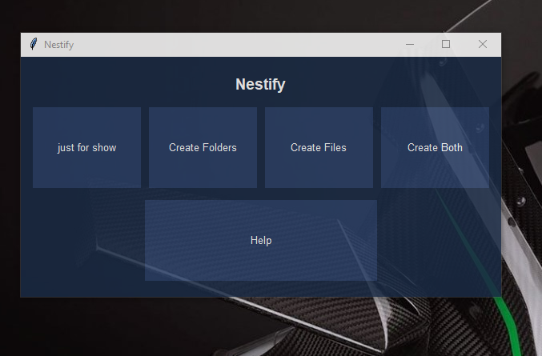

# Nestify 🗂️📄

Nestify is a Python-based desktop GUI application that allows users to effortlessly create multiple folders and files with customizable names, quantities, and formats. It’s perfect for developers, teachers, students, or anyone needing to generate structured directories quickly.

## ✨ Features

- Create multiple folders with custom names and quantities
- Create multiple files with custom names, extensions, and contents
- Create folders **with files inside**
- Smooth fade-in animation and hover effects
- Intuitive Tkinter GUI with a space-themed look
- Simple input dialogs for flexible folder/file setup

## 🖼️ GUI Preview


## 📦 Requirements

- Python 3.x
- Tkinter (usually pre-installed with Python)

To install Python:  
[Download Python](https://www.python.org/downloads/)

## 🚀 Getting Started

1. **Clone the repository:**
   ```bash
   git clone https://github.com/Naeem-360/nestify.git
2. **Run the code:**
   ```bash
   cd nestify
